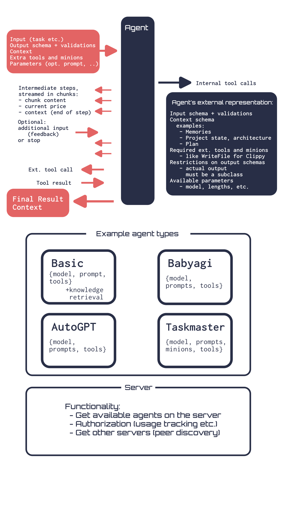

# Bloody Agents

_An agent standard_

**Overview**

This project is meant to be as general as possible, allowing to create any type of agent on any framework or in any paradigm. The point is to unify it in a way such that different agents can interact with each other, even if they are hosted on different servers. As a consequence, this also provides an interface for connecting the environments where agent is hosted and where it is acting (this means that actions can be executed locally for agents running in the cloud).

**L0.** The agent abstraction, in the most general way possible: it takes in some input, streams the intermediate steps, accepts additional feedback. Some tools are executed externally, some internally. The extra tools (or agents — they line is blurry) are passed in the agent. Output can have any schema and is validated.

**L1.** Different agent types: here we implement the basic agents and the different high-level approaches. The ReAct agent, feedbacks, and then BabyAGI, AutoGPT, Taskmaster...

**L2.** The agent server. This part includes the protocol for using an agent from another server through a websocket and the communication between servers. Overall, it will be a federative system for sharing agents. 

A useage example: let's say you are building an agent for sales outreach. Then, your clients will be able to use custom subagents for researching/writing, including from other servers. Or you have something which involves characters, and the characters will be able to be imported from anywhere.

### The Agent

An agent has the `run(...) -> Channel` function which takes as arguments the following:

1. The input (which can be of any type, restricted by the `AgentRepr`). This can include the task, the conversation history, etc.
2. The context. This is again restricted only by the `AgentRepr`. It can include, for example, memories, plan, project architecture. The difference with input is that it is passed to the tools or subagents which the agent will use and that it is returned at the end of each action step.
3. Additional minions and tools. If they are not found/supported by the agent, their calls will be returned in the step results through the channel to be made on the client. For instance, for an application performing actions on a local computer while running the agent somewhere else this could be the call to run a command. This will be objects of `ToolRepr`, `AgentRepr`. For an agent executing locally, `Agent` and `Tool` are also accepted.
4. Additional parameters of the agent, as specified in the `AgentRepr`.

The agent returns a `Channel`. The `Channel` is for streaming responses and handling additional input. It has the function `channel.steps(chunks: bool) -> Generator[(Step | StepReader) | ToolResult | MinionStart | MinionResult | FinalResult]`. The `chunks` argument determines whether to stream each step (if not, the steps will be of type `Step`, otherwise `StepReader`). The steps contain calls to tools and minions. Tool calls return `ToolResult`, and for minion calls the channel sends `MinionStart`, then the steps, then `MinionResult`. In the end, the channel yields the `FinalResult`. The channel has a `channel.input(inp: ExtraInput | ToolResult | MinionChannel)` function to give additional input or the results of tool and minion calls.

